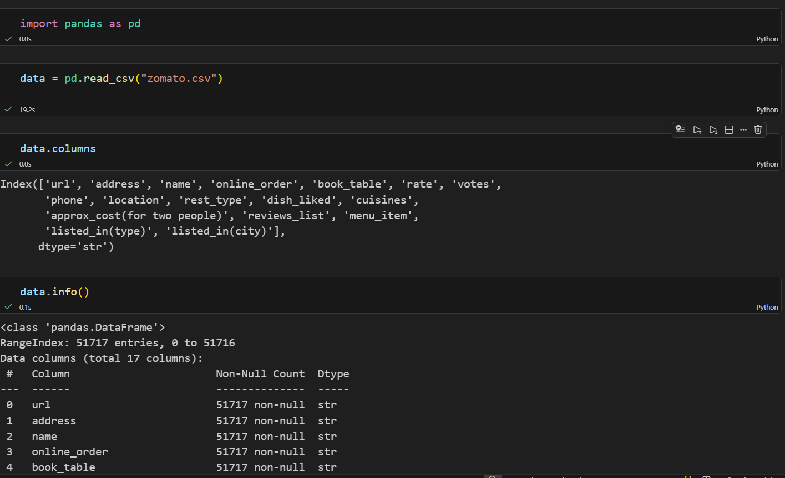

# Restaurant-Dataset-Cleaning-with-Python-Pandas
Cleaning and Preparing a Restaurant Dataset (Zomato) with Python/Pandas

## Dataset
The raw dataset used in this project is the Zomato Bangalore Restaurants dataset, 
available on Kaggle:
https://www.kaggle.com/datasets/rishikeshkonapure/zomato/data

Download `zomato.csv` and place it in the root of the project folder before running the notebook.

## Project Overview

This dataset contains restaurant listings from Zomato's Bangalore platform. Before any analysis could be performed, the raw data required significant cleaning — inconsistent rating formats, mixed-type cost columns, duplicate listings, and missing values across key fields. This notebook prepares the dataset for exploratory and business analysis, enabling questions around pricing strategy, cuisine performance, and location-based investment decisions.

## Objectives
- Deleting redundant columns
- Renaming the columns
- Dropping duplicates
- Cleaning individual columns
- Remove the NaN values from the dataset
- Check for some more Transformations

## Tools and Libraries
- Python
- Pandas

## Key Steps

### Initial Exploration

Loaded the raw dataset (51,717 rows, 17 columns) and inspected data types, null counts, and column structure using data.info() and data.shape to understand the scope of cleaning required before making any changes.

### Removing Redundant Columns

url, address, phone, location, rest_type, cuisines, reviews_list, menu_item, listed_in(type), listed_in(city)) that were either non-analytical, free-text fields unsuitable for structured analysis, or outside the scope of the business questions being answered. Retained 7 columns focused on restaurant identity, ordering features, ratings, and cost.

### Standardizing Column Names

Renamed all columns using a capitalisation loop to ensure consistent, readable naming conventions across the dataset, replacing the original inconsistent mix of lowercase and snake_case labels.

### Removing Duplicate Records

Identified 29,103 duplicate rows (56% of the dataset) using duplicated().sum(). All duplicates were removed using drop_duplicates(), reducing the dataset to 22,614 unique records.

### Handling Null Values

After removing duplicates, identified remaining nulls: 2,420 in Rate, 11,348 in Dish_liked, and 141 in Approx_cost. All rows containing null values were dropped, resulting in a final clean dataset of 11,193 records. This approach was chosen to ensure complete, reliable records for downstream analysis.

### Cleaning the Rate Column

The Rate column contained inconsistently formatted strings such as "4.1/5" and "3.8 /5" (with irregular spacing). Removed whitespace and replaced the / separator with " out of " to produce a human-readable, standardised format (e.g., "4.1 out of 5").

###  Encoding the Online_order Column

Converted the Online_order column from Yes/No string values to binary integers (1 = Yes, 0 = No) using a lambda function, making the column ready for numerical analysis and potential modelling.

### Exporting the Cleaned Dataset

Exported the final cleaned dataset to CSV using index=False to avoid writing the DataFrame index as an unwanted column — an important detail that was identified and corrected during the process.

